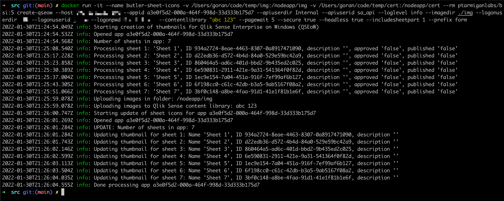

<h1 align="center">Butler Sheet Icons</h1>
<h3 align="center">Automatically create Qlik Sense sheet thumbnail images</h3>
<p align="center">
<a href="https://github.com/ptarmiganlabs/butler-sheet-icons"></a>
<a href="https://github.com/ptarmiganlabs/butler-sheet-icons/actions/workflows/docker-image-build.yml"></a>
<a href="https://github.com/ptarmiganlabs/butler-sheet-icons/actions/workflows/selfhosted-test-macos.yml"></a>
<a href="https://github.com/ptarmiganlabs/butler-sheet-icons/actions/workflows/selfhosted-test-winsrv2016.yml"></a>
</p>

A cross platform, command line tool for creating sheet thumbnails based on the actual layout of sheets in Qlik Sense apps.  
Works on both Qlik Sense Cloud apps and Qlik Sense Enterprise on Windows (QSEoW) apps.

Butler Sheet Icons can create sheet thumbnail icons for a single app or many.  
Just use the QMC (for QSEoW) to tag the apps that should be updated, or add the apps to a collection (Qlik Senes Cloud).  
Then run Butler Sheet Icons and all apps will get new sheet icons automatically!

Table of contents

- [1. Summary](#1-summary)
  - [1.1. Sample screen shots](#11-sample-screen-shots)
- [2. Install](#2-install)
  - [2.1. Certificates](#21-certificates)
  - [2.2. Content libraries](#22-content-libraries)
  - [2.3. Which part of each sheet to use as thumbnail](#23-which-part-of-each-sheet-to-use-as-thumbnail)
  - [2.4. Using Butler Sheet Icons with Qlik Sense Enterprise on Windows](#24-using-butler-sheet-icons-with-qlik-sense-enterprise-on-windows)
    - [2.4.1. Login method](#241-login-method)
    - [2.4.2. Using QSEoW's built-in Node.js](#242-using-qseows-built-in-nodejs)
- [3. Running as Node.js app](#3-running-as-nodejs-app)
- [4. Running as Docker container](#4-running-as-docker-container)
- [5. Commands](#5-commands)
  - [5.1. Command: create-qseow](#51-command-create-qseow)
    - [5.1.1. Updating sheets in a single app](#511-updating-sheets-in-a-single-app)
    - [5.1.2. Updating sheets in several apps](#512-updating-sheets-in-several-apps)
- [6. Logging](#6-logging)
- [7. Testing](#7-testing)
  
---

# 1. Summary

The basics:

- Qlik Sense applications contains zero or more *sheets*.
- Each sheet contains various kind of charts, KPIs, texts or other visualisations.
- A sheet icon/thumbnail image can be added to each sheet in a Sense app.  
  This image provides visual guidance and makes it easier for users to find the sheet they are looking for.

There are various approaches when it comes to creating useful sheet icons:

1. Use random images you've found somewhere online.  
   Usually not recommended, at least not if you want a consistent, professional looking Sense application.
2. Use animated GIFs.  
   If it's a good idea? You decide... examples can be found in the blog post "[Animated GIF horror for Qlik Sense](https://ptarmiganlabs.com/blog/2020/01/10/animated-gif-horror-for-qlik-sense/)".
3. Use a professional icon/image library such as Font Awesome.  
   This gives you a nice, consistent look across all sheet icons. Converting the images to a suitable format and uploading them to Qlik Sense can be a challenge though, here tools such as [Butler Icon Upload](https://github.com/ptarmiganlabs/butler-icon-upload) can greatly simplify things.
4. Create thumbnail images that are miniatures of the actual sheet layout.  
   The idea here is to take screen shots of all app sheets and then use these screenshots as thumbnail images for each sheet.

**The goal of the Butler Sheet Icons project is to automate option 4 above.**

Specifically:

- The tool is cross platform and runs on Windows, MacOS, Linux and as a Docker container.
- Stand-alone binaries for Windows, Linux and macOS are available for download.
- Works on both Qlik Sense Cloud and Qlik Sense Enterprise on Windows (QSEoW). Qlik Sense Desktop not supported.
- A single command will create thumbnail images, upload them to Qlik Sense and assign them as sheet icons to sheets in the Sense app(s).

By using for example Powershell (which runs on Windows, macOS and Linux these days!) and [qlik-cli](https://qlik.dev/libraries-and-tools/qlik-cli) (which is an official, supported tool from Qlik) it's possible to automatically create sheet thumbnails for ***all*** sheets in ***all*** apps in a Qlik Sense environment!

Use cases for Butler Sheet Iconsinclude

- Manual, one-off updates of a Sense app's sheet icons
- Bulk update of all sheet icons in many apps
- Update sheet icons as part of a CI/CD pipeline

## 1.1. Sample screen shots

Using Butler Sheet Icons on MacOS:


Using Butler Sheet Icons, running in PowerShell on Windows 10:


Sheet thumbnails generated by Butler Sheet Icons:


# 2. Install

This section contains details on running Butler Sheet Icons (BSI) as a Node.js application on Windows, Linux, macOS or other platform supported by Node.js.

Instructions for running under Docker are available further down on this page.

Butler Sheet Icons is built using [Node.js](https://nodejs.org/en/).  
The most recent LTS version of Node.js is a good choice.  
Download and install it according to the instructions on the Node.js site.

Then download the desired BSI version from the [download page](https://github.com/ptarmiganlabs/butler-sheet-icons/releases).  

BSI is regularly updated with new features, bug fixes and security updates - you should therefor use the latest version unless you have a good reason to use an older version.  
The downloads on the release page are automatically tested on Windows Server and macOS.

Specifically - **do not** use the main branch in the GitHub repository. It does not necessarily reflect the latest and greatest version of the code.  

Extract the downloaded zip file into suitable location (for example `d:\tools\butler-sheet-icons` on a Windows Server, then go to the `butler-sheet-icons/src` directory.  
Finally run `npm install` to download all dependencies.

On MacOS it can look like this (running from a directory called `tools`):

```bash
➜  tools wget https://github.com/ptarmiganlabs/butler-sheet-icons/archive/refs/tags/butler-sheet-icons-v1.2.1.zip
--2022-01-30 20:02:13--  https://github.com/ptarmiganlabs/butler-sheet-icons/archive/refs/tags/butler-sheet-icons-v1.2.1.zip
Resolving github.com (github.com)... 140.82.121.3
Connecting to github.com (github.com)|140.82.121.3|:443... connected.
HTTP request sent, awaiting response... 302 Found
Location: https://codeload.github.com/ptarmiganlabs/butler-sheet-icons/zip/refs/tags/butler-sheet-icons-v1.2.1 [following]
--2022-01-30 20:02:13--  https://codeload.github.com/ptarmiganlabs/butler-sheet-icons/zip/refs/tags/butler-sheet-icons-v1.2.1
Resolving codeload.github.com (codeload.github.com)... 140.82.121.9
Connecting to codeload.github.com (codeload.github.com)|140.82.121.9|:443... connected.
HTTP request sent, awaiting response... 200 OK
Length: unspecified [application/zip]
Saving to: ‘butler-sheet-icons-v1.2.1.zip’

butler-sheet-icons-v1.2.1.zip                  [  <=>                                                                                 ]   1.55M  6.14MB/s    in 0.3s

2022-01-30 20:02:14 (6.14 MB/s) - ‘butler-sheet-icons-v1.2.1.zip’ saved [1622158]

➜  tools unzip butler-sheet-icons-v1.2.1.zip
Archive:  butler-sheet-icons-v1.2.1.zip
68ed3b87dccf1a992c03de47fcc07a945c2b2063
   creating: butler-sheet-icons-butler-sheet-icons-v1.2.1/
  inflating: butler-sheet-icons-butler-sheet-icons-v1.2.1/LICENSE
  inflating: butler-sheet-icons-butler-sheet-icons-v1.2.1/README.md
   creating: butler-sheet-icons-butler-sheet-icons-v1.2.1/docs/
   creating: butler-sheet-icons-butler-sheet-icons-v1.2.1/docs/img/
  inflating: butler-sheet-icons-butler-sheet-icons-v1.2.1/docs/img/create-qseow-appoverview_1.png
  inflating: butler-sheet-icons-butler-sheet-icons-v1.2.1/docs/img/create-qseow-appoverview_2.png
  inflating: butler-sheet-icons-butler-sheet-icons-v1.2.1/docs/img/create-qseow-appoverview_3.png
  inflating: butler-sheet-icons-butler-sheet-icons-v1.2.1/docs/img/create-qseow-created-images_1.png
  inflating: butler-sheet-icons-butler-sheet-icons-v1.2.1/docs/img/create-qseow-loginpage_1.png
  inflating: butler-sheet-icons-butler-sheet-icons-v1.2.1/docs/img/create-qseow-loginpage_2.png
  inflating: butler-sheet-icons-butler-sheet-icons-v1.2.1/docs/img/create-qseow-qmc_1.png
  inflating: butler-sheet-icons-butler-sheet-icons-v1.2.1/docs/img/create-qseow-win_1.png
  inflating: butler-sheet-icons-butler-sheet-icons-v1.2.1/docs/img/create-qseow-win_2.png
  inflating: butler-sheet-icons-butler-sheet-icons-v1.2.1/docs/img/create-qseow_1.png
  inflating: butler-sheet-icons-butler-sheet-icons-v1.2.1/docs/img/create-qseow_sheetpart_1.png
  inflating: butler-sheet-icons-butler-sheet-icons-v1.2.1/docs/qseow-demo_1.md
   creating: butler-sheet-icons-butler-sheet-icons-v1.2.1/src/
  inflating: butler-sheet-icons-butler-sheet-icons-v1.2.1/src/CHANGELOG.md
 extracting: butler-sheet-icons-butler-sheet-icons-v1.2.1/src/README.md
  inflating: butler-sheet-icons-butler-sheet-icons-v1.2.1/src/butler-sheet-icons.js
  inflating: butler-sheet-icons-butler-sheet-icons-v1.2.1/src/certificates.js
  inflating: butler-sheet-icons-butler-sheet-icons-v1.2.1/src/contentlibrary.js
  inflating: butler-sheet-icons-butler-sheet-icons-v1.2.1/src/createthumbnails.js
  inflating: butler-sheet-icons-butler-sheet-icons-v1.2.1/src/enigma.js
  inflating: butler-sheet-icons-butler-sheet-icons-v1.2.1/src/globals.js
   creating: butler-sheet-icons-butler-sheet-icons-v1.2.1/src/img/
 extracting: butler-sheet-icons-butler-sheet-icons-v1.2.1/src/img/do-not-delete
  inflating: butler-sheet-icons-butler-sheet-icons-v1.2.1/src/package-lock.json
  inflating: butler-sheet-icons-butler-sheet-icons-v1.2.1/src/package.json
  inflating: butler-sheet-icons-butler-sheet-icons-v1.2.1/src/qrs.js
  inflating: butler-sheet-icons-butler-sheet-icons-v1.2.1/src/updatesheets.js
  inflating: butler-sheet-icons-butler-sheet-icons-v1.2.1/src/upload.js
➜  tools cd butler-sheet-icons-butler-sheet-icons-v1.2.1/src
➜  src npm install

added 512 packages, and audited 513 packages in 11s

69 packages are looking for funding
  run `npm fund` for details

found 0 vulnerabilities
➜  src
```

On Windows 10 or Windows Server, using PowerShell, the same operation can look like this:

```powershell
PS C:\tools> Invoke-WebRequest https://github.com/ptarmiganlabs/butler-sheet-icons/archive/refs/tags/butler-sheet-icons-v1.2.1.zip -OutFile butler-sheet-icons-v1.2.1.zip
PS C:\tools> Expand-Archive -Path butler-sheet-icons-v1.2.1.zip -DestinationPath C:\tools
PS C:\tools> cd .\butler-sheet-icons-butler-sheet-icons-v1.2.1\src\
PS C:\tools\butler-sheet-icons-butler-sheet-icons-v1.2.1\src> npm i

> puppeteer@13.1.2 install C:\tools\butler-sheet-icons-butler-sheet-icons-v1.2.1\src\node_modules\puppeteer
> node install.js

Downloading Chromium r950341 - 176.3 Mb [====================] 100% 0.0s
Chromium (950341) downloaded to C:\tools\butler-sheet-icons-butler-sheet-icons-v1.2.1\src\node_modules\puppeteer\.local-chromium\win64-950341
npm WARN optional SKIPPING OPTIONAL DEPENDENCY: fsevents@2.3.2 (node_modules\fsevents):
npm WARN notsup SKIPPING OPTIONAL DEPENDENCY: Unsupported platform for fsevents@2.3.2: wanted {"os":"darwin","arch":"any"} (current: {"os":"win32","arch":"x64"})

added 511 packages from 357 contributors and audited 512 packages in 28.578s

69 packages are looking for funding
  run `npm fund` for details

found 0 vulnerabilities

PS C:\tools\butler-sheet-icons-butler-sheet-icons-v1.2.1\src>
```


## 2.1. Certificates

When using Butler Sheet Icons (BSI) with QSEoW you must first export certificates from the QMC. BSI will use those certificates to authenticate with the QSEoW APIs.

Instructions for exporting the certificates are available on [Qlik's help pages](https://help.qlik.com/en-US/sense-admin/May2021/Subsystems/DeployAdministerQSE/Content/Sense_DeployAdminister/QSEoW/Administer_QSEoW/Managing_QSEoW/export-certificates.htm).

Once you have the `client.pem`, `client_key.pem` and `root.pem` files you should store them some place where BSI can access them. The `--certfile`, `--certkeyfile` and `--rootcertfile` options are used to tell BSI where the files are stored.

The default location where BSI will look for the certificates is in a directory called `cert` directly under the main source code directory (using PowerShell):

```powershell
PS C:\tools\butler-sheet-icons-butler-sheet-icons-v1.2.1\src> dir


    Directory: C:\tools\butler-sheet-icons-butler-sheet-icons-v1.2.1\src


Mode                 LastWriteTime         Length Name
----                 -------------         ------ ----
d-----        30/01/2022     21:58                cert
d-----        30/01/2022     20:09                img
d-----        30/01/2022     20:12                node_modules
-a----        29/01/2022     07:31           4942 butler-sheet-icons.js
-a----        29/01/2022     07:31           1536 certificates.js
-a----        29/01/2022     07:31          12022 CHANGELOG.md
-a----        29/01/2022     07:31           1807 contentlibrary.js
-a----        29/01/2022     07:31          13244 createthumbnails.js
-a----        29/01/2022     07:31           1497 enigma.js
-a----        29/01/2022     07:31           1334 globals.js
-a----        30/01/2022     20:12         179335 package-lock.json
-a----        29/01/2022     07:31           1239 package.json
-a----        29/01/2022     07:31            845 qrs.js
-a----        29/01/2022     07:31             15 README.md
-a----        29/01/2022     07:31           4457 updatesheets.js
-a----        29/01/2022     07:31           2848 upload.js


PS C:\tools\butler-sheet-icons-butler-sheet-icons-v1.2.1\src>
```

## 2.2. Content libraries

Butler Sheet Icons (BSI) will create image thumbnails for all sheets in a QSEoW application, then upload those images to a Sense content library.

**That content library must exist before Butler Sheet Icons is executed!!**

If not told otherwise by means of the `--contentlibrary` option, BSI will try to upload the images to a content library called "Butler sheet thumbnails".

## 2.3. Which part of each sheet to use as thumbnail

A sheet in a standard Qlik Sense application consists of several parts.  
Starting at the bottom of the screen we have

1. The main part of the sheet. This is where tables, charts etc are shown.
2. A sheet title.
3. A selection bar. Shows what selections are currently made in the app.
4. A menu bar. Here we find the main menu to the left, the app name, a drop-down menu showing all sheets etc.

Butler Sheet Icons lets you control which part of each sheet will be used as the thumbnail for that sheet.

The parameter `--includesheetpart` is used to control this.  
The allowed values are:

1: The main sheet area only. I.e. no sheet title, selection bar or menu bar.  
2: Same as 1 but with sheet title added.  
3: Same as 2 but with selection bar added.  
4: Same as 3 but with menu bar added, i.e. the entire page

Looking at a Qlik Sense sheet we have:


`--includesheetpart` is an optional parameter with a default value of 1.

## 2.4. Using Butler Sheet Icons with Qlik Sense Enterprise on Windows

### 2.4.1. Login method

QSEoW offers two different built-in ways to log in using username/pwd.  
These are set per virtual proxy in the "Windows authentication pattern" field. Valid options are `Windows` and `Form`.

When set to `Windows` and a user access the virtual proxy from a Windows computer, the user will get a login popup in which she enters username and password. On non-Windows computers the user will instead see a web form.

When set to `Form` the user will see a web form in which username and password is entered:


Butler Sheet Icons only supports the `Form` method.  
Thus, if you use BSI on Windows you should make sure to specify a virtual proxy (`--prefix` option) that uses `Form` authentication!

If the `--prefix` option is not specified when starting BSI, the default '/' virtual proxy will be used.

### 2.4.2. Using QSEoW's built-in Node.js

While this might sound like a good idea, there are several reasons to stay away from it:

- QSEoW's bundled Node.js version is pretty old. As of QSEoW Feb 2021 Node.js version 12.x is bundled. Latest version is 16.x.
- You don't get the npm tool, which is needed to install the dependencies Butler Sheet Icons need (the `npm install` command). 
  It may be possible to manually install npm and then use Sense's bundled Node version, but it's not recommended.

# 3. Running as Node.js app

If unsure how to use the tool, this option is usually the easiest to get started with.

The concept is simple: You start Node.js and pass in the main script file of Butler Sheet Icons as a parameter to the Node app. A set of options the control what BSI will do, what apps it will operate on etc.

Note that all source code files (including the main `butler-sheet-icons.js` file) live in the src/ directory. Thus first change to that directory before starting the tool:

```powershell
PS C:\tools\butler-sheet-icons-butler-sheet-icons-v1.2.1\src> node butler-sheet-icons.js
>>
Usage: butler-sheet-icons [options] [command]

This is a utility that creates thumbnail images based on the actual layout of sheets in Qlik Sense applications.
The created thumbnails are saved to disk and/or uploaded to the Sense app as new sheet thumbnail images.

Options:
  -V, --version           output the version number
  -h, --help              display help for command

Commands:
  create-qseow [options]  create thumbnail images based on the layout of each sheet in a Qlik Sense Enterprise on
                          Windows (QSEoW) application
  help [command]          display help for command
PS C:\tools\butler-sheet-icons-butler-sheet-icons-v1.2.1\src>
```

The tool starts, but as we haven't told it what to do it will just show the top-level help info.

We can see there's a single command available in this version of Butler Sheet Icons: `create-qseow`.  
Future BSI versions may have additional commands.

# 4. Running as Docker container

Butler Sheet Icons is also available as a Docker image. This can be useful if you use Docker or Kubernetes as part of a CI/CD pipeline.

The features, commands and options available in the Docker version of BSI are exactly the same as what's available in the regular Node.js version.  

When running BSI in a Docker container on macOs it looks like this (Linux will be similar, Windows can be tricky as the image formats differ from those on Linux/MacOS).

```bash
➜  docker run -it --rm ptarmiganlabs/butler-sheet-icons:latest --help
Unable to find image 'ptarmiganlabs/butler-sheet-icons:latest' locally
latest: Pulling from ptarmiganlabs/butler-sheet-icons
a2abf6c4d29d: Pull complete
716b0e096692: Pull complete
eb13b01b6650: Pull complete
d19607afd777: Pull complete
664676c8ede0: Pull complete
4a21f35a6c5c: Pull complete
dfce2b7742ee: Pull complete
dd84a4ac7dc0: Pull complete
8e52b3ceabb7: Pull complete
0865bf6d480e: Pull complete
26cf010d1aa0: Pull complete
f7c0d126f4c0: Pull complete
c6ac444a3a7e: Pull complete
Digest: sha256:bfaba0612a8eb75f49ad627fa6f866ee9282770cf4a7404e8df9684abe657983
Status: Downloaded newer image for ptarmiganlabs/butler-sheet-icons:latest
Usage: butler-sheet-icons [options] [command]

This is a utility that creates thumbnail images based on the actual layout of sheets in Qlik Sense applications.
The created thumbnails are saved to disk and/or uploaded to the Sense app as new sheet thumbnail images.

Options:
  -V, --version           output the version number
  -h, --help              display help for command

Commands:
  create-qseow [options]  create thumbnail images based on the layout of each sheet in a Qlik Sense Enterprise on Windows (QSEoW) application
  help [command]          display help for command
➜  
```

If we pass in proper parameters we will get new sheet icons in the specified app:



Note: The command above assumes the certificates exported from QSEoW are available in `/Users/goran/code/temp/cert`.

# 5. Commands

List available commands using the --help option:

```bash
➜  src git:(master) node butler-sheet-icons.js --help
Usage: butler-sheet-icons [options] [command]

This is a utility that creates thumbnail images based on the actual layout of sheets in Qlik Sense applications.
The created thumbnails are saved to disk and/or uploaded to the Sense app as new sheet thumbnail images.

Options:
  -V, --version           output the version number
  -h, --help              display help for command

Commands:
  create-qseow [options]  create thumbnail images based on the layout of each sheet in a Qlik Sense Enterprise on Windows (QSEoW) application
  help [command]          display help for command
➜  src git:(master)
```

Great, we can see there is a command called `create-qseow`. Let's run it:

```bash
➜  src git:(master) node butler-sheet-icons.js create-qseow
error: required option '--host <host>' not specified
➜  src git:(master)
```

This is an example of some options being required/mandatory while others are optional.  
The `--host` option is mandatory, which makes sense: The tool must know to which Sense server to connect.

All required options must be specified before the tool will proceed and do any actual work.

## 5.1. Command: create-qseow

The command assumes there is standard Windows, form based authentication (username + password) available on the specified virtual proxy (which is specified using the `--prefix` option).

A complete session using this command is described [here](./docs/qseow-demo_1.md).

```bash
➜  src git:(master) node butler-sheet-icons.js create-qseow --help
Usage: butler-sheet-icons create-qseow [options]

Create thumbnail images based on the layout of each sheet in a Qlik Sense Enterprise on Windows (QSEoW) application.
Multiple apps can be updated with a single command. In this case a Qlik Sense tag is used to identify which apps will be updated.

Options:
  --loglevel <level>                 log level (error, warning, info, verbose, debug, silly) (default: "info")
  --host <host>                      Qlik Sense server IP/FQDN
  --engineport <port>                Qlik Sense server engine port (default: "4747")
  --qrsport <port>                   Qlik Sense server repository service (QRS) port (default: "4242")
  --port <port>                      Qlik Sense http/https port. 443 is default for https, 80 for http
  --schemaversion <string>           Qlik Sense engine schema version (default: "12.612.0")
  --appid <id>                       Qlik Sense app whose master items should be modified. Ignored if --qliksensetag is specified (default: "")
  --certfile <file>                  Qlik Sense certificate file (exported from QMC) (default: "./cert/client.pem")
  --certkeyfile <file>               Qlik Sense certificate key file (exported from QMC) (default: "./cert/client_key.pem")
  --rootcertfile <file>              Qlik Sense root certificate file (exported from QMC) (default: "./cert/root.pem")
  --rejectUnauthorized <true|false>  Ignore warnings when Sense certificate does not match the --host paramater (default: false)
  --prefix <prefix>                  Qlik Sense virtual proxy prefix (default: "")
  --secure <true|false>              connection to Qlik Sense engine is via https (default: true)
  --apiuserdir <directory>           user directory for user to connect with when using Sense APIs
  --apiuserid <userid>               user ID for user to connect with when using Sense APIs
  --logonuserdir <directory>         user directory for user to connect with when logging into web UI
  --logonuserid <userid>             user ID for user to connect with when logging into web UI
  --logonpwd <password>              password for user to connect with
  --hosttype <type>                  type of Qlik Sense server (qseow) (default: "qseow")
  --headless <true|false>            headless (=not visible) browser (true, false) (default: true)
  --pagewait <seconds>               number of seconds to wait after moving to a new sheet. Set this high enough so the sheet has time to render properly (default: 5)
  --imagedir <directory>             directory in which thumbnail images will be stored. Relative or absolute path (default: "./img")
  --contentlibrary <library-name>    Qlik Sense content library to which thumbnails will be uploaded (default: "Butler sheet thumbnails")
  --includesheetpart <value>         which part of sheets should be use to take screenshots. 1=object area only, 2=1 + sheet title, 3=2 + selection bar, 4=3 + menu bar (default: "1")
  --qliksensetag <value>             Used to control which Sense apps should have their sheets updated with new icons. All apps with this tag will be updated. If this parameter is specified the --appid parameter will be ignored (default: "")
  -h, --help                         display help for command➜  src git:(master)
```

Here we see all options available for the create-qseow command. When possible there are default values (listed at the end of each option description).

### 5.1.1. Updating sheets in a single app

A command specifying many (but not all) options can look like this:

```bash
node butler-sheet-icons.js  create-qseow --host 10.11.12.13 --appid a3e0f5d2-000a-464f-998d-33d333b175d7 --apiuserdir Internal --apiuserid sa_api --loglevel info --logonuserdir MYDIR --logonuserid userjoe --logonpwd supersecret --contentlibrary 'abc 123' --pagewait 5 --secure true --headless true --imagedir './img'  --includesheetpart 2
```

Running the command will

1. Create new sheet icons for all sheets in the app with app ID=a3e0f5d2-000a-464f-998d-33d333b175d7.
2. create thumbnail images in the `./img` directory (specificed by the `--imagedir` option). Images are created (=screen shots are taken)
   - Before the Sense login screen is submitted
   - After the Sense login screen = the app overview page, where all sheets are shown.
   - After stepping to a new sheet.
3. Each screen shot will include the main sheet area and the title row above it (`--includesheetpart 2`).
4. Upload the sheet thumbnails to the content library specified in the `--contentlibrary` option. The login page and app overview screen shots are not uploaded.
5. Each sheet's icon is updated with the corresponding image in the content library.

### 5.1.2. Updating sheets in several apps

If multiple apps are to be updated the `--qliksensetag` parameter can be used.

When specified it will override the `--appid` parameter. In this case Butler Sheet Icons will look for all Sense apps that has the tag specified by `--qliksensetag` and then update the sheet icons for all those apps.

The command can look like this. Note how the tag name can include emojis - this is surprisingly useful when creating Sense tags for different purposes!

```bash
node butler-sheet-icons.js  create-qseow --host 10.11.12.13 --appid a3e0f5d2-000a-464f-998d-33d333b175d7 --apiuserdir Internal --apiuserid sa_api --loglevel info --logonuserdir MYDIR --logonuserid userjoe --logonpwd supersecret --contentlibrary 'abc 123' --pagewait 5 --secure true --headless true --imagedir './img'  --includesheetpart 2 --qliksensetag "👍😎 updateSheetThumbnail"
```

# 6. Logging

Logging is controlled by the `--loglevel` option.

Valid values are (in order of increasing verbosity): error, warning, info, verbose, debug, silly.

When using log level silly all websocket communication to/from the Sense server will be logged to the console.  
This will give you *very* detailed logging, but this can be useful when investigating bugs or other issues.

# 7. Testing

Whenever changes are made to any part of Butler Sheet Icons the new version is automatically tested against a real Qlik Sense Enterprise on Windows server. Tests are made on the following platforms and Node.js versions

- Windows Server 2016
  - Latest available Node.js 14
  - Latest available Node.js 16
  - Latest available Node.js LTS
- MacOS Monterey
  - Latest available Node.js 14
  - Latest available Node.js 16
  - Latest available Node.js LTS

The current status of each test suite is shown as badges at the top of the [readme file](https://github.com/ptarmiganlabs/butler-sheet-icons/blob/main/README.md).

These test serve a purpose.  
If you struggle to get Butler Sheet Icons working you can check those badges.  
If they show that the platform you're interested in works, you should look at your command line parameters etc. The error is probably on your side.  

If on the other hand the badges show that the platform you're interested in is broken, you might want to raise an issue (if someone else hasn't already). Alerts are also sent to the project maintaners, so they should already be aware of the issue.
