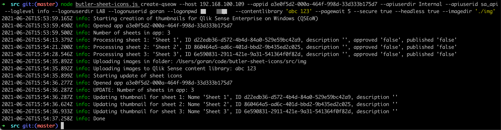

<h1 align="center">Butler Sheet Icons</h1>
<h3 align="center">Automatically create Qlik Sense sheet thumbnail images</h3>
<p align="center">
<a href="https://github.com/ptarmiganlabs/butler-sheet-icons"></a>
<a href="https://github.com/ptarmiganlabs/butler-sheet-icons/actions/workflows/docker-image-build.yml"></a>
<a href="https://github.com/ptarmiganlabs/butler-sheet-icons/actions/workflows/selfhosted-test-macos.yml"></a>
<a href="https://github.com/ptarmiganlabs/butler-sheet-icons/actions/workflows/selfhosted-test-winsrv2016.yml"></a>
<a href="https://codeclimate.com/github/ptarmiganlabs/butler-sheet-icons/maintainability"></a>
</p>

A cross platform, command line tool for creating sheet thumbnails based on the actual layout of sheets in Qlik Sense Enterprise on Windows applications.

Table of contents

- [1. Summary](#1-summary)
  - [1.1. Sample screen shots](#11-sample-screen-shots)
- [2. Install](#2-install)
  - [2.1. Certificates](#21-certificates)
  - [2.2. Content libraries](#22-content-libraries)
  - [2.3. Notes on using Butler Sheet Icons with Qlik Sense Enterprise on Windows](#23-notes-on-using-butler-sheet-icons-with-qlik-sense-enterprise-on-windows)
    - [2.3.1. Login method](#231-login-method)
    - [2.3.2. Using QSEoW's built-in Node.js](#232-using-qseows-built-in-nodejs)
- [3. Running as Node.js app](#3-running-as-nodejs-app)
- [4. Running as Docker container](#4-running-as-docker-container)
- [5. Commands](#5-commands)
  - [5.1. Command: create-qseow](#51-command-create-qseow)
- [6. Logging](#6-logging)
- [7. Testing](#7-testing)
  
---

# 1. Summary

- Qlik Sense applications contains zero or more *sheets*.
- Each sheet contains various kind of charts, KPIs, texts or other visualisations.
- A sheet icon/thumbnail image can be added to each sheet in a Sense app. This image makes it easier for users to find the sheet they are looking for.

There are various aproaches when it comes to creating useful sheet icons:

1. Use random images you've found somewhere online.  
   Usually not recommended, at least not if you want a consistent, professional looking Sense application.
2. Use animated GIFs.  
   If it's a good idea? You decide... examples can be found in the blog post "[Animated GIF horror for Qlik Sense](https://ptarmiganlabs.com/blog/2020/01/10/animated-gif-horror-for-qlik-sense/)".
3. Use a professional icon/image library such as Font Awesome.  
   This gives you a nice, consistent look across all sheet icons. Converting the images to a suitable format and uploading them to Qlik Sense can be a challenge though, here tools such as [Butler Icon Upload](https://github.com/ptarmiganlabs/butler-icon-upload) can greatly simplify things.
4. Create thumbnail images that are miniatures of the actual sheet layout.  
   The idea here is to take screen shots of all app sheets and then use these screenshots as thumbnail images.

**The goal of the Butler Sheet Icons project is to automate option 4 above.**

Specifically:

- The tool is cross platform and runs on Windows, MacOS, Linux and as a Docker container.
- A single command will create thumbnail images, upload them to a Qlik Sense content library and assign them as sheet icons to all sheets in the Sense app.

By using for example Powershell and [Qlik CLI Windows](https://github.com/ahaydon/Qlik-Cli-Windows) it's possible to automatically create sheet thumbnails for all sheets in all apps in a Qlik Sense Enterprise environment!

Use cases for the Butler Sheet Icons tool include

- Manual, one-off updates of a Sense app's sheet icons
- Bulk update of all sheet icons in many apps
- Update sheet icons as part of a CI/CD process

As of this writing Butler Sheet Icons supports Qlik Sense Enterprise on Windows.  
Support for Qlik cloud may be added in the future.

## 1.1. Sample screen shots

Using Butler Sheet Icons on MacOS:



Using Butler Sheet Icons on Windows 10:


Sheet thumbnails generated by Butler Sheet Icons:


# 2. Install

Butler sheet icon is built using [Node.js](https://nodejs.org/en/).  
The most recent LTS version of Node.js is a good choice.  
Download and install it according to the instructions on the Node.js site.

Clone the repository (or download + extract the desired [release](https://github.com/ptarmiganlabs/butler-sheet-icons/releases)), go to the `butler-sheet-icons/src` directory and then run `npm install` to download all dependencies.

On MacOS it can look like this:

```bash
➜  code code git clone https://github.com/ptarmiganlabs/butler-sheet-icons.git
zsh: command not found: code
➜  code git clone https://github.com/ptarmiganlabs/butler-sheet-icons.git
Cloning into 'butler-sheet-icons'...
remote: Enumerating objects: 76, done.
remote: Counting objects: 100% (76/76), done.
remote: Compressing objects: 100% (53/53), done.
remote: Total 76 (delta 28), reused 60 (delta 18), pack-reused 0
Receiving objects: 100% (76/76), 987.86 KiB | 5.28 MiB/s, done.
Resolving deltas: 100% (28/28), done.
➜  code cd butler-sheet-icons
➜  butler-sheet-icons git:(master) cd src
➜  src git:(master) npm i

> puppeteer@10.0.0 install /Users/goran/code/butler-sheet-icons/src/node_modules/puppeteer
> node install.js

Downloading Chromium r884014 - 113.6 Mb [====================] 99% 0.0s
added 97 packages from 111 contributors and audited 97 packages in 10.269s

8 packages are looking for funding
  run `npm fund` for details

found 0 vulnerabilities

➜  src git:(master) ✗
```

## 2.1. Certificates

When using Butler Sheet Icons (BSI) with QSEoW you must first export certificates from the QMC. BSI will use those certificates to authenticate with QSEoW.

Instructions for exporting the certificates are available on [Qlik's help pages](https://help.qlik.com/en-US/sense-admin/May2021/Subsystems/DeployAdministerQSE/Content/Sense_DeployAdminister/QSEoW/Administer_QSEoW/Managing_QSEoW/export-certificates.htm).

Once you have the `client.pem`, `client_key.pem` and `root.pem` files you should store them some place where BSI can access them. The `--certfile`, `--certkeyfile` and `--rootcertfile` options are used to tell BSI where the files are stored.

The default location where BSI will look for the certificates is in a directory called `cert` directly under the main source code directory:

```bash
➜  src git:(master) ls -la
total 72
drwxr-xr-x  12 goran  staff   384 Jun 26 17:47 .
drwxr-xr-x  10 goran  staff   320 Jun 26 17:16 ..
-rw-r--r--   1 goran  staff  3557 Jun 26 17:16 butler-sheet-icons.js
drwxr-xr-x   7 goran  staff   224 Jun 26 17:47 cert
-rw-r--r--   1 goran  staff  1224 Jun 26 17:16 contentlibrary.js
-rw-r--r--   1 goran  staff  6696 Jun 26 17:16 createthumbnails.js
-rw-r--r--   1 goran  staff  1188 Jun 26 17:16 enigma.js
-rw-r--r--   1 goran  staff  1601 Jun 26 17:16 globals.js
drwxr-xr-x   3 goran  staff    96 Jun 26 17:16 img
-rw-r--r--   1 goran  staff   788 Jun 26 17:16 qrs.js
-rw-r--r--   1 goran  staff  3503 Jun 26 17:16 updatesheets.js
-rw-r--r--   1 goran  staff  2930 Jun 26 17:16 upload.js
➜  src git:(master)
```

## 2.2. Content libraries

Butler Sheet Icons (BSI) will create image thumbnails for all sheets in a QSEoW application, then upload those images to a Sense content library.

**That content library must exist before Butler Sheet Icons is executed!!**

If not told otherwise by means of the `--contentlibrary` option, BSI will try to upload the images to a content library called "Butler sheet thumbnails".

## 2.3. Notes on using Butler Sheet Icons with Qlik Sense Enterprise on Windows

### 2.3.1. Login method

QSEoW offers two different built-in ways to log in using username/pwd.  
These are set per virtual proxy in the "Windows authentication pattern" field. Valid options are `Windows` and `Form`.

When set to `Windows` and a user access the virtual proxy from a Windows computer, the user will get a login popup in which she enters username and password. On non-Windows computers the user will instead see a web form, see below.

When set to `Form` the user will see a web form in which username and password is entered.

Butler Sheet Icons only supports the `Form` method.  
Thus, if you use BSI on Windows you should make sure to specify a virtual proxy (`--prefix` option) that uses `Form` authentication!

### 2.3.2. Using QSEoW's built-in Node.js

While this might sound like a good idea, there are several reasons to stay away from it:

- QSEoW's bundled Node.js version is pretty old. As of QSEoW Feb 2021 Node.js version 12.x is bundled. Latest version is 16.x.
- You don't get the npm tool, which is needed to install the dependencies Butler Sheet Icons need (the `npm install` command). 
  It may be possible to manually install npm and then use Sense's bundled Node version, but it's not recommended.

# 3. Running as Node.js app

If unsure how to use the tool, this option is usually the easiest to get started with.

The concept is simple: You start Node.js and pass in the main script file of Butler Sheet Icons as a parameter to the Node app.

Note that all source code files (including the main `butler-sheet-icons.js` file) live in the src/ directory. Thus first change to that directory before starting the tool:

```bash
➜  butler-sheet-icons git:(master) cd src
➜  src git:(master) node butler-sheet-icons.js
Usage: butler-sheet-icons [options] [command]

This is a utility that creates thumbnail images based on the actual layout of sheets in Qlik Sense applications.
The created thumbnails are saved to disk and/or uploaded to the Sense app as new sheet thumbnail images.

Options:
  -V, --version           output the version number
  -h, --help              display help for command

Commands:
  create-qseow [options]  create thumbnail images based on the layout of each sheet in a Qlik Sense Enterprise on Windows (QSEoW) application
  help [command]          display help for command
➜  src git:(master)
```

The tool starts, but as we haven't told it what to do it will just show the top-level help info.

We can see there's a single command available in this version of Butler Sheet Icons: `create-qseow`.  
Future version may have additional commands too.

# 4. Running as Docker container

Butler Sheet Icons is also available as a Docker image. This can be useful if you use Docker or Kubernetes as part of a CI/CD pipeline.

The commands available in the Docker version of BSI are exactly the same as what's available in the regular Node.js version.  

When running BSI in a Docker container on MacOs it looks like this (Linux will be similar, Windows can be tricky as the image formats differ from those on Linux/MacOS).

```bash
➜  docker run -it --rm ptarmiganlabs/butler-sheet-icons:latest --help
Unable to find image 'ptarmiganlabs/butler-sheet-icons:latest' locally
latest: Pulling from ptarmiganlabs/butler-sheet-icons
199ebcd83264: Pull complete
ddbb155879c0: Pull complete
c194bbaa3d8b: Pull complete
6154ac87d7f3: Pull complete
0c283e88ced7: Pull complete
dba101298560: Pull complete
1d8bfd4e555f: Pull complete
757e41ffbdcc: Pull complete
6e055c4b8721: Pull complete
219ea737f9ad: Pull complete
0f3b7b7db5b8: Pull complete
319d4c5dd422: Pull complete
7bd723a22158: Pull complete
754be9fb2e15: Pull complete
Digest: sha256:b570b19e1e8a4320f4bae43a5c6a8c3f8acec27c157137c3418a1311d737054f
Status: Downloaded newer image for ptarmiganlabs/butler-sheet-icons:latest
Usage: butler-sheet-icons [options] [command]

This is a utility that creates thumbnail images based on the actual layout of sheets in Qlik Sense applications.
The created thumbnails are saved to disk and/or uploaded to the Sense app as new sheet thumbnail images.

Options:
  -V, --version           output the version number
  -h, --help              display help for command

Commands:
  create-qseow [options]  create thumbnail images based on the layout of each sheet in a Qlik Sense Enterprise on Windows (QSEoW) application
  help [command]          display help for command
➜  
```

If we pass in proper parameters we will get new sheet icons in the specified app:

```bash
➜  docker run -it --name butler-sheet-icons -v /Users/goran/code/temp/cert:/nodeapp/cert --rm ptarmiganlabs/butler-sheet-icons:1.1.0 create-qseow --host 192.168.100.109 --appid a3e0f5d2-000a-464f-998d-33d333b175d7 --apiuserdir Internal --apiuserid sa_api --loglevel info --imagedir ./img --logonuserdir MYDIR --logonuserid goran --logonpwd supersecret --contentlibrary "abc 123" --pagewait 3 --secure true --headless true --prefix form
Unable to find image 'ptarmiganlabs/butler-sheet-icons:1.1.0' locally
1.1.0: Pulling from ptarmiganlabs/butler-sheet-icons
07aded7c29c6: Pull complete
92706508d124: Pull complete
29e8836fa52b: Pull complete
c69c406f761b: Pull complete
1ad0d9e4f0be: Pull complete
3d7ea9abcdb8: Pull complete
4fbec49c8828: Pull complete
4a70bb69a4a3: Pull complete
b9e0544b64a9: Pull complete
c862eadcc6b5: Pull complete
184eab8c49d2: Pull complete
5c87f2fa6820: Pull complete
Digest: sha256:8074a0f298410f4a609b993c50647db941fab7e75b6c802d2c5cc369da5bc509
Status: Downloaded newer image for ptarmiganlabs/butler-sheet-icons:1.1.0
2021-09-30T03:34:08.258Z info: Starting creation of thumbnails for Qlik Sense Enterprise on Windows (QSEoW)
2021-09-30T03:34:08.916Z info: Opened app a3e0f5d2-000a-464f-998d-33d333b175d7
2021-09-30T03:34:08.937Z info: Number of sheets in app: 4
2021-09-30T03:34:23.618Z info: Processing sheet 1: 'Thumbnail demo', ID 934a2724-8eae-4463-8307-0a8917471090, description '', approved 'false', published 'false'
2021-09-30T03:34:32.982Z info: Processing sheet 2: 'Sheet 1', ID d22edb36-d572-4b4d-84a0-529e59bc42a9, description '', approved 'false', published 'false'
2021-09-30T03:34:42.301Z info: Processing sheet 3: 'Sheet 2', ID 860464a5-ad6c-401d-bbd2-9b435ed2c025, description '', approved 'false', published 'false'
2021-09-30T03:34:50.941Z info: Processing sheet 4: 'Sheet 3', ID 6e590831-2911-421e-9a31-541364f0f82d, description '', approved 'false', published 'false'
2021-09-30T03:34:59.846Z info: Uploading images in folder: /nodeapp/img
2021-09-30T03:34:59.847Z info: Uploading images to Qlik Sense content library: abc 123
2021-09-30T03:34:59.868Z info: Starting update of sheet icons
2021-09-30T03:35:00.249Z info: Opened app a3e0f5d2-000a-464f-998d-33d333b175d7
2021-09-30T03:35:00.278Z info: UPDATE: Number of sheets in app: 4
2021-09-30T03:35:00.278Z info: Updating thumbnail for sheet 1: Name 'Thumbnail demo', ID 934a2724-8eae-4463-8307-0a8917471090, description ''
2021-09-30T03:35:00.594Z info: Updating thumbnail for sheet 2: Name 'Sheet 1', ID d22edb36-d572-4b4d-84a0-529e59bc42a9, description ''
2021-09-30T03:35:00.891Z info: Updating thumbnail for sheet 3: Name 'Sheet 2', ID 860464a5-ad6c-401d-bbd2-9b435ed2c025, description ''
2021-09-30T03:35:01.185Z info: Updating thumbnail for sheet 4: Name 'Sheet 3', ID 6e590831-2911-421e-9a31-541364f0f82d, description ''
2021-09-30T03:35:01.546Z info: Done
➜  
```

Note: The command above assumes the certificates exported from QSEoW are available in `/Users/goran/code/temp/cert`.


# 5. Commands

List available commands using the --help option:

```bash
➜  src git:(master) node butler-sheet-icons.js --help
Usage: butler-sheet-icons [options] [command]

This is a utility that creates thumbnail images based on the actual layout of sheets in Qlik Sense applications.
The created thumbnails are saved to disk and/or uploaded to the Sense app as new sheet thumbnail images.

Options:
  -V, --version           output the version number
  -h, --help              display help for command

Commands:
  create-qseow [options]  create thumbnail images based on the layout of each sheet in a Qlik Sense Enterprise on Windows (QSEoW) application
  help [command]          display help for command
➜  src git:(master)
```

Great, we can see there is a command called `create-qseow`. Let's run it:

```bash
➜  src git:(master) node butler-sheet-icons.js create-qseow
error: required option '--host <host>' not specified
➜  src git:(master)
```

This is an example of some options being required/mandatory while others are optional.  
The `--host` option is mandatory, which makes sense: The tool must know to which Sense server to connect.

All required options must be specified before the tool will proceed and do any actual work.

## 5.1. Command: create-qseow

The command assumes there is standard Windows, form based authentication (username + password) available on the specified virtual proxy (which is specified using the `--prefix` option).

A complete session using this command is described [here](./docs/qseow-demo_1.md).

```bash
➜  src git:(master) node butler-sheet-icons.js create-qseow --help
Usage: butler-sheet-icons create-qseow [options]

create thumbnail images based on the layout of each sheet in a Qlik Sense Enterprise on Windows (QSEoW) application

Options:
  --loglevel <level>                 log level (error, warning, info, verbose, debug, silly) (default: "info")
  --host <host>                      Qlik Sense server IP/FQDN
  --engineport <port>                Qlik Sense server engine port (default: "4747")
  --qrsport <port>                   Qlik Sense server repository service (QRS) port (default: "4242")
  --port <port>                      Qlik Sense http/https port. 443 is default for https, 80 for http
  --schemaversion <string>           Qlik Sense engine schema version (default: "12.612.0")
  --appid <id>                       Qlik Sense app whose master items should be modified
  --certfile <file>                  Qlik Sense certificate file (exported from QMC) (default: "./cert/client.pem")
  --certkeyfile <file>               Qlik Sense certificate key file (exported from QMC) (default: "./cert/client_key.pem")
  --rootcertfile <file>              Qlik Sense root certificate file (exported from QMC) (default: "./cert/root.pem")
  --rejectUnauthorized <true|false>  Ignore warnings when Sense certificate doesn not match the --host paramater (default: false)
  --prefix <prefix>                  Qlik Sense virtual proxy prefix (default: "")
  --secure <true|false>              connection to Qlik Sense engine is via https (default: true)
  --apiuserdir <directory>           user directory for user to connect with when using Sense APIs
  --apiuserid <userid>               user ID for user to connect with when using Sense APIs
  --logonuserdir <directory>         user directory for user to connect with when logging into web UI
  --logonuserid <userid>             user ID for user to connect with when logging into web UI
  --logonpwd <password>              password for user to connect with
  --hosttype <type>                  type of Qlik Sense server (qseow) (default: "qseow")
  --headless <true|false>            headless (=not visible) browser (true, false) (default: true)
  --pagewait <seconds>               number of seconds to wait after moving to a new sheet. Set this high enough so the sheet has time to render properly (default: 5)
  --imagedir <directory>             directory in which thumbnail images will be stored. Relative or absolute path (default: "./img")
  --contentlibrary <library-name>    Qlik Sense content library to which thumbnails will be uploaded (default: "Butler sheet thumbnails")
  -h, --help                         display help for command
➜  src git:(master)
```

Here we see all options available for the create-qseow command. When possible there are default values (listed at the end of each option description).

A command specifying many (but not all) options can look like this:

```bash
node butler-sheet-icons.js  create-qseow --host 192.168.100.109 --appid a3e0f5d2-000a-464f-998d-33d333b175d7 --apiuserdir Internal --apiuserid sa_api --loglevel info --logonuserdir LAB --logonuserid goran --logonpwd supersecret --contentlibrary 'abc 123' --pagewait 5 --secure true --headless true --imagedir './img'
```

Actually running the command will

1. create thumbnail images in the `./img` directory (specificed by the `--imagedir` option). Images are created (=screen shots are taken)
   - Before the Sense login screen is submitted
   - After the Sense login screen = the app overview page, where all sheets are shown.
   - After stepping to a new sheet.
2. Upload the sheet thumbnails to the content library specified in the `--contentlibrary` option. The login page and app overview screen shots are not uploaded.
3. Each sheet's icon is updated with the corresponding image in the content library.

# 6. Logging

Logging is controlled by the --loglevel option.

Valid values are (in order of increasing verbosity): error, warning, info, verbose, debug, silly.

When using log level silly all websocket communication to/from the Sense server will be logged to the console.  
This will give you *very* detailed logging, but this can be useful when investigating bugs or other issues.

# 7. Testing

Whenever changes are made to any part of Butler Sheet Icons the new version is automatically tested against a real Qlik Sense Enterprise on Windows server. Tests are made on the following platforms:

- Windows Server 2016: Node.js 14.17.1, Node.js 16.4.0
- MacOS: Node.js 16.4.0

The current status of each test suite is shown as badges at the top of the [readme file](https://github.com/ptarmiganlabs/butler-sheet-icons/blob/main/README.md).

These test serve a purpose.  
If you struggle to get Butler Sheet Icons working you can check those badges.  
If they show that the platform you're interested in works, you should look at your command line parameters etc. The error is probably on your side.  

If on the other hand the badges show that the platform you're interested in is broken, you might want to raise an issue (if someone else hasn't already). Alerts are also sent to the project maintaners, so they should already be aware of the issue.
