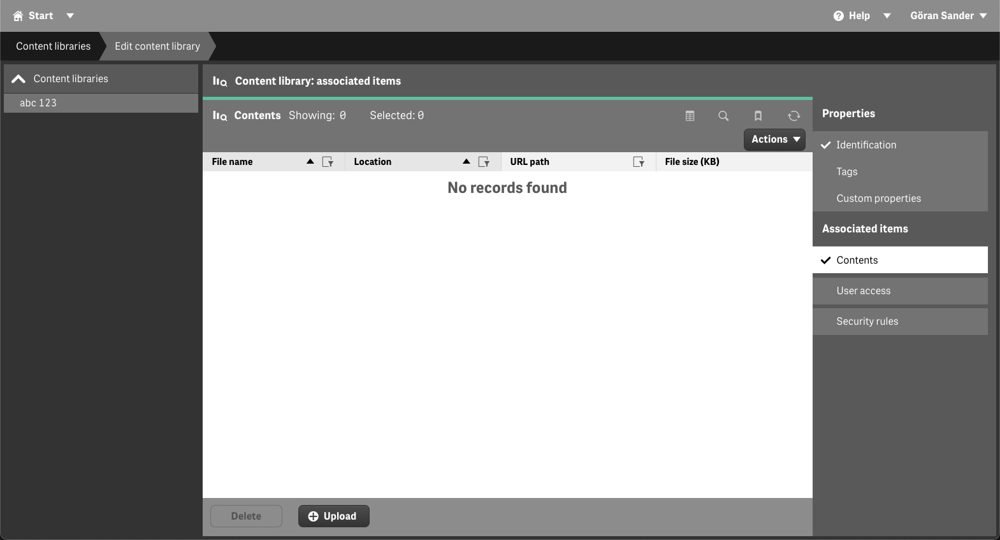
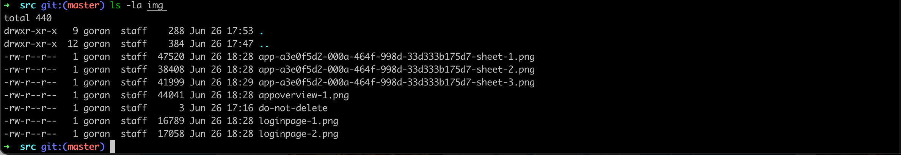
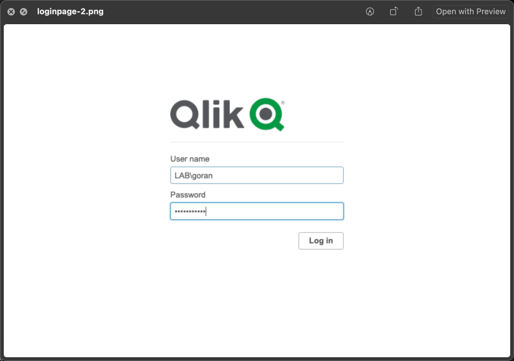
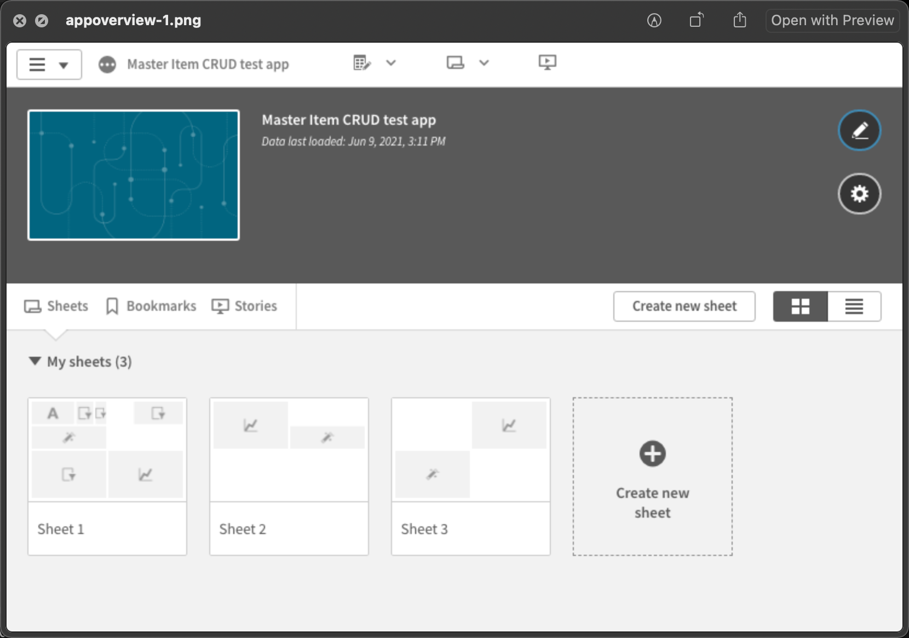

# 1. Example: Using Butler Sheet Icons with Qlik Sense Enterprise on Windows

Below is an example where BSI is used to create and update sheet icons for a QSEoW application.

- There are three sheets in the app
- There exists a content library called `abc 123`.

Let's first look at the app overview *before* running BSI:

Note that there are no sheet icons on any of the 3 sheets.

Same thing when looking at the `abc 123` content library - it's empty:

Now let's run Butler Sheet Icons.

On MacOs it looks like this with INFO level debugging:

On Windows10 you will see something like below.  
Note how strings are enclosed with double quotes rather than single quotes, and how the image directory path is specified:

Once again opening the app's overview page we see that it now has new sheet icons for all sheets.

Butler Sheet Icons will take screenshots of all sheets, but also of the login page and the app overview page.

Looking in the `abc 123` content library it now has a image for each sheet in the app. The format used for the images in the content library is

    app-<app id>-sheet-<sheet number>.png

For example `app-a3e0f5d2-000a-464f-998d-33d333b175d7-sheet-2.png`.

Finally, looking in the ./img directory (as specified by the `--imagedir` option) we find the three sheet screen shots, but also three screenshots associated with the app itself. Two are from the login page when Butler Sheet Icons logs into Qlik Sense and one is from the app overview within the Sense app (before the sheets got new sheet icons!):

